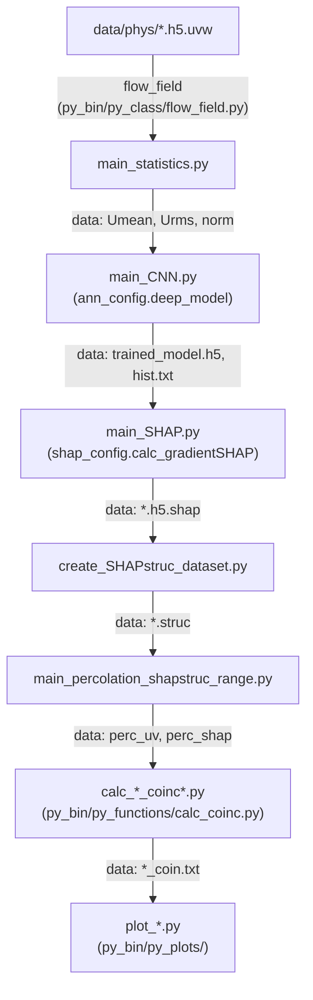

# xai-channel-flow Developer Guide

> Baseline: `main` branch, commit `6c82482` (initial/only commit history available at mining time). For contributors who need to read source, extend the analysis, or adapt it to a new dataset.

---

## 1. Project positioning & scope

This repository implements the explainable-deep-learning pipeline for wall-bounded turbulence described in Cremades, Hoyas & Vinuesa, *Nat. Commun.* 16, 10189 (2025) (see [`README.md`](./README.md) for the citation-resolution note). Given DNS snapshots of a turbulent channel flow, it trains a convolutional U-Net to predict future velocity fields, computes per-grid-point SHAP (Expected Gradients) importance maps for that model, detects classical coherent structures (Q events, streaks, Chong/Hunt vortices) and SHAP-based structures via percolation thresholding, and quantifies the spatial coincidence between the two families of structures.

Headline capabilities:
- Statistics/normalization computation over raw DNS fields (`code/main_statistics.py`).
- CNN (U-Net) training and prediction (`code/main_CNN.py`, `code/py_bin/py_class/ann_config.py::deep_model`).
- SHAP attribution via Expected Gradients (`code/main_SHAP.py`, `code/py_bin/py_class/shap_config.py::shap_config`).
- Coherent-structure detection and SHAP/classical-structure coincidence analysis (`code/py_bin/py_class/{uv,streak,chong,hunt,shap}_structure.py`, `code/py_bin/py_functions/calc_coinc.py`).

For the user-facing run commands and parameter knobs behind each capability above, see [`user_guide.md`](./user_guide.md) — this guide covers source-level architecture and avoids duplicating those how-tos.

## 2. Metadata snapshot

- Package name: none — this is a flat script collection (no `setup.py`/`pyproject.toml`), invoked as `python main_*.py` from inside `code/`.
- License: MIT (`LICENSE`, Copyright (c) 2025 ancrebo).
- Language runtime: Python 3 + TensorFlow/Keras (`code/py_bin/py_class/ann_config.py` builds `tf.keras` models). No version constraints are pinned anywhere in the repo — no `requirements.txt`/`environment.yml`/`pyproject.toml` exists at the repo root (see also `user_guide.md` §2, `tutorial.md` §1, which cross-reference this fact rather than restate it).
- Core dependencies (inferred from imports, not pinned anywhere): TensorFlow/Keras, NumPy, h5py (reads `data/phys/*.h5.uvw`), and the vendored `shap` and `slicer` packages under `code/py_bin/py_packages/` (each carries its own `LICENSE.txt`; treated as third-party, out of scope here).
- Version source: none found. The only `_version.py` in the tree belongs to the vendored `shap` package (`code/py_bin/py_packages/shap/_version.py`), not this project.

## 3. Repository layout

```
code/
  main_statistics.py          entry point: compute mean/rms/normalization
  main_CNN.py                 entry point: train the U-Net predictor
  prepare_tfrecords.py        entry point: build TFRecords ("check_tfrecords.py" internally)
  main_SHAP.py                entry point: compute SHAP (Expected Gradients) maps
  main_statisticsSHAP.py      entry point: statistics of the SHAP field
  create_SHAPstruc_dataset.py entry point: threshold SHAP maps into structures
  main_percolation_shapstruc_range.py  entry point: percolation curves
  calc_*_coinc*.py            entry points: coincidence between structure families
  plot_*.py                   ~30 plotting entry points (see topology.md inventory)
  configuration/              per-run parameter modules (see §5)
  py_bin/py_class/            domain classes: flow_field, {uv,streak,chong,hunt,shap}_structure,
                               ann_config.deep_model, shap_config.shap_config, plot_format
  py_bin/py_functions/        I/O + numerics: umean, urms, normalization, percolation, calc_coinc,
                               merge_data, CNNblock_definition, trainvali_data, read_tfrecord
  py_bin/py_plots/            plotting helpers used by the plot_*.py entry points
  py_bin/py_remote/           read_remote.py — SSH staging of data from a remote cluster
  py_bin/py_packages/         vendored third-party: shap/, slicer/, cloudpickle/ (out of scope)
data/phys/                    11 sample DNS velocity snapshots (P125_83pi.<index>.h5.uvw)
docs/guides/                  this documentation set
```

## 4. Runtime architecture overview



Narrative: every stage's input/output filenames are attribute lookups on `code/configuration/folders.py` (e.g. `folders.umean_file`, `folders.shap_folder`), not literal strings inside `save(...)`/`load(...)` calls. This is why the auto-generated `topology.md` reports **0 data-contract edges for this pipeline** — the regex-based detector only matches a literal or same-file-variable filename argument, so this attribute-lookup indirection is invisible to it. (An earlier version of `topology.md` reported 32 data-contract edges here, but those were internal to the vendored `shap` package's own `save()`/`load()` serialization methods, not this project's chain; the vendored `shap`/`slicer`/`cloudpickle` packages are now excluded from detection entirely — see `topology.md` §4 Excluded as Vendored — so the current 0-edge count is correct, not a sign the real chain was missed.) The chain above was reconstructed by hand from `code/configuration/folders.py` and the `main_*.py` entry points, each of which does `exec("from configuration import folders as folders")` and then reads `folders.<name>_file`/`folders.<name>_folder` attributes before calling into a `py_bin` class or function.

## 5. Top-level namespace

> Skipped — this repo has no package `__init__.py`/public-alias layer. Each `main_*.py` script is its own entry point; there is no single import surface to tabulate. (Per `doc_outlines.md`: "numbering may be adjusted if a phase is clearly inapplicable.")

## 6. Backend / platform abstraction

Mostly not applicable — there is no multi-framework backend switch. The one indirection present is a remote-data fallback: `code/configuration/folders.py::ssh_flag_train` toggles between local reads and `code/py_bin/py_remote/read_remote.py` for staging `data/phys/` from a remote server over SSH; `code/main_CNN.py` and `code/prepare_tfrecords.py` both branch on this flag when building their `DL_data` dict.

## 7. Data & domain layer

- `code/py_bin/py_class/flow_field.py::flow_field` — wraps a DNS snapshot; `__init__` takes `{"folder","file","down_x","down_y","down_z","L_x","L_y","L_z","rey","utau"}`; `shape_tensor()` and `flow_grid()` derive the downsampled tensor shape and coordinate grid used by every downstream class.
- Coherent-structure classes, one per structure family, all sharing the same method surface — `calculate_matstruc()`, `segment_struc()`, `save_struc()`, `read_struc()`, `add_SHAP(data_in={"nsamples":1})`:
  - `code/py_bin/py_class/uv_structure.py::uv_structure` — Q events (Reynolds-stress quadrant analysis).
  - `code/py_bin/py_class/streak_structure.py::streak_structure` — low/high-speed streaks.
  - `code/py_bin/py_class/chong_structure.py::chong_structure` and `hunt_structure.py::hunt_structure` — vortex-identification criteria.
  - `code/py_bin/py_class/shap_structure.py::shap_structure` (plus `shap_uvw_structure.py`, `shap_uw_vsign_structure.py`, `shap_intensity_structure.py`) — SHAP-value-thresholded structures, the object of the coincidence analysis.
- `code/py_bin/py_class/structures.py::structures` is the shared base-level geometry/segmentation logic (`separate_structures`, `physicalproperties_structures`, `detect_quadrant`, `segmentation`) that the family-specific classes build on.

## 8. Automatic differentiation / computation core

Reinterpreted for this repo: there is no PDE-residual autodiff core; the analogous "computation core" is the SHAP attribution engine. `code/py_bin/py_class/shap_config.py::shap_config._calculate_gradientshaps` and `_calculate_kernelshaps` implement Expected Gradients (Erion, Janizek, Sturmfels, Lundberg & Lee, *Nat. Mach. Intell.* 3(7), 620–631, 2021 — cited directly in `code/main_SHAP.py`'s module docstring) on top of the vendored `shap.GradientExplainer`. Public entry points: `shap_config.calc_gradientSHAP()` and `calc_kernelSHAP()`; results persist via `write_shap()`/`read_shap()`.

## 9. Networks / models catalog

| Class | Path | Constructor signature |
| --- | --- | --- |
| `deep_model` | `code/py_bin/py_class/ann_config.py:27` | `__init__(self, data_in={"uvw_folder":...})` (line 114) |

`deep_model.architecture_Unet(data_in={"x_in":[],"flag_print":True})` (line 1250) builds the U-Net from `code/py_bin/py_functions/CNNblock_definition.py::block`/`invblock` (down-sampling / up-sampling conv blocks parameterized by `nfil`, `stride`, `activ`, `kernel`).

## 10. Optimizers & schedulers

- Optimizer: RMSprop, configured via `code/configuration/training_data.py::learat` (learning rate) and `optmom` (momentum). No named optimizer registry or per-backend LR-decay matrix exists — single fixed optimizer, single fixed schedule (`epoch_max`/`epoch_save` control checkpoint cadence, not decay).

## 11. Training main loop

Step-by-step narrative of `code/py_bin/py_class/ann_config.py::deep_model` as driven by `code/main_CNN.py`:

1. `__init__` (line 114) — stores data-path/shape parameters (`uvw_folder`, `data_folder`, `umean_file`, `unorm_file`, padding, downsampling).
2. `define_model` (line 222) — stores training hyperparameters (`training_data.py`'s `learat`, `batch_size`, `nfil`, `stride`, ...) and dispatches to `create_model()`/`model_base()`.
3. `train_model` (line 575) — the fit loop; `prepare_data()` (740) and `prepare_tfrecords()` (1435) handle the two supported data-loading paths (`prep_data` flag in `training_data.py`); `_save_training` (771) checkpoints every `epoch_save` epochs.
4. `pred_field`/`field_error`/`pred_error`/`pred_error_y`/`pred_urms` (892–1182) — post-training evaluation, driven by `code/calc_pred_error.py` and `code/plot_predictions.py`.
5. Persistence — `model_write`/`model_read` (`code/configuration/folders.py`) name the `.h5` checkpoint; `hist_file` stores the training history read back by `code/plot_training_epoch.py`.

## 12. Callback / hook system

> Skipped — no Keras-callback framework is used. The closest equivalent is `deep_model._save_training` (line 771), a manual epoch-count checkpoint, and `code/py_bin/py_functions/multiworker_checkpoint.py`, used only under the multi-worker strategy (§14).

## 13. Loss & metric registries

No loss-identifier registry exists. `deep_model.create_model()` (`ann_config.py:487`) compiles the model directly with `tf.keras.losses.MeanSquaredError()` and an `RMSprop` optimizer (`learning_rate=self.learat, momentum=self.optmom`) — a single fixed loss, not a swappable string identifier (confirmed at `ann_config.py:522,531,536`). `model_base()` (`ann_config.py:542`) only builds the U-Net input/output graph and does not itself touch the loss.

## 14. Parallel / distributed training

Real support exists: `code/configuration/training_data.py::multi_worker` and `flag_central` select between TensorFlow's `MirroredStrategy` and `CentralStorageStrategy`; `code/py_bin/py_functions/multiworker_checkpoint.py` handles checkpointing under the multi-worker case. `code/main_CNN.py`'s module docstring documents the exact SLURM launch script used on the Chalmers "Alvis" cluster (multi-node, multi-GPU via `srun`).

## 15. Contribution SOPs & debugging

### 15.1 Dev environment

```bash
# No requirements.txt/environment.yml in this repo (see §2 Metadata snapshot).
cd code
python main_statistics.py   # first pipeline stage, smallest smoke test
```

> Recommendation: pin `tensorflow`, `numpy`, `h5py` in a requirements file before onboarding new contributors.

### 15.2 Adding a new coherent-structure type (template)

1. Subclass the shared pattern in `code/py_bin/py_class/structures.py::structures`, following `chong_structure.py`/`hunt_structure.py` as the smallest existing examples.
2. Implement `calculate_matstruc()`, `segment_struc()`, `save_struc()`, `read_struc()`, and `add_SHAP()` to match the existing structure classes' method surface.
3. Add the new folder/file naming pair to `code/configuration/folders.py` and a corresponding `calc_<newtype>_shap_coinc*.py` entry point, following `calc_chong_shap_coinc_y_range.py` as a template.

### 15.3 Common error → root cause

| Symptom | Check |
| --- | --- |
| HDF5 "unable to lock file" on shared filesystems | Every `main_*.py` sets `os.environ['HDF5_USE_FILE_LOCKING'] = 'FALSE'` at import time — confirm this line executed before any h5py access. |
| `prepare_tfrecords()` finds no input | `code/configuration/folders.py::tfrecord_folder` must exist and be populated by `code/prepare_tfrecords.py` before `main_CNN.py` is run with `training_data.py::prep_data = True`. |
| Not runtime-tested — this pass is a static code read; no GPU/data was available to execute the pipeline and surface additional failure modes. | — |

---

## References

- Main paper / canonical citation: Cremades, A., Hoyas, S. & Vinuesa, R. *Nat. Commun.* 16, 10189 (2025), DOI 10.1038/s41467-025-65199-9 — **resolved externally**, not present in-repo. See [`README.md`](./README.md) §Citation for the verification note.
- Online docs: none.
