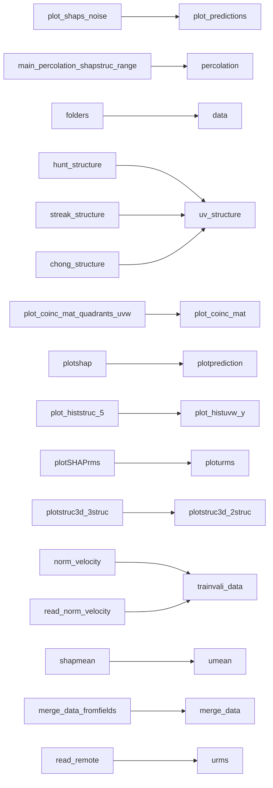

# xai-channel-flow — Repository Topology Map

> Auto-generated by `repo-doc-miner/scripts/gen_topology.py` (v2, topology-first). This is the **first deliverable** of the mining process: a structural map of the repository. Refine the detected edges by reading the most important manifests, then deep-dive each module along these edges.

---

## 1. Structural Topology

```mermaid
graph TD
    subgraph sg_code["code"]
        code["code<br/>module"]
        style code fill:#e1f0ff,stroke:#3b82f6
        plot_uv_3d["plot_uv_3d<br/>script"]
        style plot_uv_3d fill:#f1f8e9,stroke:#7cb342
        calc_streak_shap_coinc_y_range["calc_streak_shap_coinc_y_range<br/>script"]
        style calc_streak_shap_coinc_y_range fill:#f1f8e9,stroke:#7cb342
        plot_training_epoch["plot_training_epoch<br/>script"]
        style plot_training_epoch fill:#f1f8e9,stroke:#7cb342
        calc_uv_shap_coinc_y_range["calc_uv_shap_coinc_y_range<br/>script"]
        style calc_uv_shap_coinc_y_range fill:#f1f8e9,stroke:#7cb342
        plot_coinc_pairs_uv_streak_chong_2_shap["plot_coinc_pairs_uv_streak_chong_2_shap<br/>script"]
        style plot_coinc_pairs_uv_streak_chong_2_shap fill:#f1f8e9,stroke:#7cb342
        plot_Q_streak_chong_coinc_y_matrix_cont_shap["plot_Q_streak_chong_coinc_y_matrix_cont_shap<br/>script"]
        style plot_Q_streak_chong_coinc_y_matrix_cont_shap fill:#f1f8e9,stroke:#7cb342
        main_CNN["main_CNN<br/>script"]
        style main_CNN fill:#f1f8e9,stroke:#7cb342
        plot_shaps_noise["plot_shaps_noise<br/>script"]
        style plot_shaps_noise fill:#f1f8e9,stroke:#7cb342
        create_SHAPstruc_dataset["create_SHAPstruc_dataset<br/>script"]
        style create_SHAPstruc_dataset fill:#f1f8e9,stroke:#7cb342
        calc_Q_chong_streak_coinc_y["calc_Q_chong_streak_coinc_y<br/>script"]
        style calc_Q_chong_streak_coinc_y fill:#f1f8e9,stroke:#7cb342
        main_statistics["main_statistics<br/>script"]
        style main_statistics fill:#f1f8e9,stroke:#7cb342
        calc_pred_error["calc_pred_error<br/>script"]
        style calc_pred_error fill:#f1f8e9,stroke:#7cb342
        plot_streak_3d["plot_streak_3d<br/>script"]
        style plot_streak_3d fill:#f1f8e9,stroke:#7cb342
        calc_chong_shap_coinc_y_range["calc_chong_shap_coinc_y_range<br/>script"]
        style calc_chong_shap_coinc_y_range fill:#f1f8e9,stroke:#7cb342
        plot_predictions["plot_predictions<br/>script"]
        style plot_predictions fill:#f1f8e9,stroke:#7cb342
        main_percolation_shapstruc_range["main_percolation_shapstruc_range<br/>script"]
        style main_percolation_shapstruc_range fill:#f1f8e9,stroke:#7cb342
        main_SHAP["main_SHAP<br/>script"]
        style main_SHAP fill:#f1f8e9,stroke:#7cb342
        plot_histuvw_uv_y_range["plot_histuvw_uv_y_range<br/>script"]
        style plot_histuvw_uv_y_range fill:#f1f8e9,stroke:#7cb342
        main_statisticsSHAP["main_statisticsSHAP<br/>script"]
        style main_statisticsSHAP fill:#f1f8e9,stroke:#7cb342
        plot_shap_3d["plot_shap_3d<br/>script"]
        style plot_shap_3d fill:#f1f8e9,stroke:#7cb342
        shap_check_repetitions["shap_check_repetitions<br/>script"]
        style shap_check_repetitions fill:#f1f8e9,stroke:#7cb342
        plot_histuvw_chong_y_range["plot_histuvw_chong_y_range<br/>script"]
        style plot_histuvw_chong_y_range fill:#f1f8e9,stroke:#7cb342
        plot_histuvw_streak_y_range["plot_histuvw_streak_y_range<br/>script"]
        style plot_histuvw_streak_y_range fill:#f1f8e9,stroke:#7cb342
        plot_Q_streak_chong_coinc_y_matrix_cont_shap_zoom["plot_Q_streak_chong_coinc_y_matrix_cont_shap_zoom<br/>script"]
        style plot_Q_streak_chong_coinc_y_matrix_cont_shap_zoom fill:#f1f8e9,stroke:#7cb342
        plot_chong_3d["plot_chong_3d<br/>script"]
        style plot_chong_3d fill:#f1f8e9,stroke:#7cb342
        plot_histuvw_shap_y_range["plot_histuvw_shap_y_range<br/>script"]
        style plot_histuvw_shap_y_range fill:#f1f8e9,stroke:#7cb342
        prepare_tfrecords["prepare_tfrecords<br/>script"]
        style prepare_tfrecords fill:#f1f8e9,stroke:#7cb342
        shap_data["shap_data<br/>script"]
        style shap_data fill:#f1f8e9,stroke:#7cb342
        training_data["training_data<br/>script"]
        style training_data fill:#f1f8e9,stroke:#7cb342
        stats_data["stats_data<br/>script"]
        style stats_data fill:#f1f8e9,stroke:#7cb342
        channel_data["channel_data<br/>script"]
        style channel_data fill:#f1f8e9,stroke:#7cb342
        evaluate_data["evaluate_data<br/>script"]
        style evaluate_data fill:#f1f8e9,stroke:#7cb342
        folders["folders<br/>script"]
        style folders fill:#f1f8e9,stroke:#7cb342
        stats_data_shap["stats_data_shap<br/>script"]
        style stats_data_shap fill:#f1f8e9,stroke:#7cb342
        uv_structure["uv_structure<br/>script"]
        style uv_structure fill:#f1f8e9,stroke:#7cb342
        shap_config["shap_config<br/>script [xai]"]
        style shap_config fill:#f1f8e9,stroke:#7cb342
        hunt_structure["hunt_structure<br/>script"]
        style hunt_structure fill:#f1f8e9,stroke:#7cb342
        shap_uvw_structure["shap_uvw_structure<br/>script"]
        style shap_uvw_structure fill:#f1f8e9,stroke:#7cb342
        shap_uw_vsign_structure["shap_uw_vsign_structure<br/>script"]
        style shap_uw_vsign_structure fill:#f1f8e9,stroke:#7cb342
        plot_format["plot_format<br/>script"]
        style plot_format fill:#f1f8e9,stroke:#7cb342
        shap_intensity_structure["shap_intensity_structure<br/>script"]
        style shap_intensity_structure fill:#f1f8e9,stroke:#7cb342
        streak_structure["streak_structure<br/>script"]
        style streak_structure fill:#f1f8e9,stroke:#7cb342
        flow_field["flow_field<br/>script"]
        style flow_field fill:#f1f8e9,stroke:#7cb342
        shap_structure["shap_structure<br/>script"]
        style shap_structure fill:#f1f8e9,stroke:#7cb342
        ann_config["ann_config<br/>script"]
        style ann_config fill:#f1f8e9,stroke:#7cb342
        structures["structures<br/>script"]
        style structures fill:#f1f8e9,stroke:#7cb342
        chong_structure["chong_structure<br/>script"]
        style chong_structure fill:#f1f8e9,stroke:#7cb342
        AlvisResolver["AlvisResolver<br/>script"]
        style AlvisResolver fill:#f1f8e9,stroke:#7cb342
        plotSHAPrms_rmsnomean["plotSHAPrms_rmsnomean<br/>script"]
        style plotSHAPrms_rmsnomean fill:#f1f8e9,stroke:#7cb342
        plotSHAPmean["plotSHAPmean<br/>script"]
        style plotSHAPmean fill:#f1f8e9,stroke:#7cb342
        plot_coinc["plot_coinc<br/>script"]
        style plot_coinc fill:#f1f8e9,stroke:#7cb342
        plotstruc3d["plotstruc3d<br/>script"]
        style plotstruc3d fill:#f1f8e9,stroke:#7cb342
        plotstruc3d_quadrants_uw_vsign["plotstruc3d_quadrants_uw_vsign<br/>script"]
        style plotstruc3d_quadrants_uw_vsign fill:#f1f8e9,stroke:#7cb342
        plotumean["plotumean<br/>script"]
        style plotumean fill:#f1f8e9,stroke:#7cb342
        ploturms["ploturms<br/>script"]
        style ploturms fill:#f1f8e9,stroke:#7cb342
        plot_histuvw_y["plot_histuvw_y<br/>script"]
        style plot_histuvw_y fill:#f1f8e9,stroke:#7cb342
        plot_coinc_mat_quadrants_uvw["plot_coinc_mat_quadrants_uvw<br/>script"]
        style plot_coinc_mat_quadrants_uvw fill:#f1f8e9,stroke:#7cb342
        plotstruc3d_quadrants_uvw["plotstruc3d_quadrants_uvw<br/>script"]
        style plotstruc3d_quadrants_uvw fill:#f1f8e9,stroke:#7cb342
        plotstruc3d_4struc["plotstruc3d_4struc<br/>script"]
        style plotstruc3d_4struc fill:#f1f8e9,stroke:#7cb342
        plotpercolation["plotpercolation<br/>script"]
        style plotpercolation fill:#f1f8e9,stroke:#7cb342
        plot_coinc_mat["plot_coinc_mat<br/>script"]
        style plot_coinc_mat fill:#f1f8e9,stroke:#7cb342
        plotprediction["plotprediction<br/>script"]
        style plotprediction fill:#f1f8e9,stroke:#7cb342
        plotshap["plotshap<br/>script"]
        style plotshap fill:#f1f8e9,stroke:#7cb342
        plot_histstruc_5["plot_histstruc_5<br/>script"]
        style plot_histstruc_5 fill:#f1f8e9,stroke:#7cb342
        plotSHAPrms["plotSHAPrms<br/>script"]
        style plotSHAPrms fill:#f1f8e9,stroke:#7cb342
        plot_coinc_mat_quadrants_uw_vsign["plot_coinc_mat_quadrants_uw_vsign<br/>script"]
        style plot_coinc_mat_quadrants_uw_vsign fill:#f1f8e9,stroke:#7cb342
        plot_hist_y["plot_hist_y<br/>script"]
        style plot_hist_y fill:#f1f8e9,stroke:#7cb342
        plottrain["plottrain<br/>script"]
        style plottrain fill:#f1f8e9,stroke:#7cb342
        plot_coinc_mat_3d["plot_coinc_mat_3d<br/>script"]
        style plot_coinc_mat_3d fill:#f1f8e9,stroke:#7cb342
        ploterrory["ploterrory<br/>script"]
        style ploterrory fill:#f1f8e9,stroke:#7cb342
        plotstruc3d_2struc["plotstruc3d_2struc<br/>script"]
        style plotstruc3d_2struc fill:#f1f8e9,stroke:#7cb342
        plotstruc3d_3struc["plotstruc3d_3struc<br/>script"]
        style plotstruc3d_3struc fill:#f1f8e9,stroke:#7cb342
        normalization_normaldist["normalization_normaldist<br/>script"]
        style normalization_normaldist fill:#f1f8e9,stroke:#7cb342
        multiworker_checkpoint["multiworker_checkpoint<br/>script"]
        style multiworker_checkpoint fill:#f1f8e9,stroke:#7cb342
        umean["umean<br/>script"]
        style umean fill:#f1f8e9,stroke:#7cb342
        shaprms["shaprms<br/>script"]
        style shaprms fill:#f1f8e9,stroke:#7cb342
        percolation["percolation<br/>script"]
        style percolation fill:#f1f8e9,stroke:#7cb342
        padding_field["padding_field<br/>script"]
        style padding_field fill:#f1f8e9,stroke:#7cb342
        norm_velocity["norm_velocity<br/>script"]
        style norm_velocity fill:#f1f8e9,stroke:#7cb342
        calc_coinc["calc_coinc<br/>script"]
        style calc_coinc fill:#f1f8e9,stroke:#7cb342
        merge_data["merge_data<br/>script"]
        style merge_data fill:#f1f8e9,stroke:#7cb342
        CNNblock_definition["CNNblock_definition<br/>script"]
        style CNNblock_definition fill:#f1f8e9,stroke:#7cb342
        trainvali_data["trainvali_data<br/>script"]
        style trainvali_data fill:#f1f8e9,stroke:#7cb342
        read_norm_velocity["read_norm_velocity<br/>script"]
        style read_norm_velocity fill:#f1f8e9,stroke:#7cb342
        read_velocity["read_velocity<br/>script"]
        style read_velocity fill:#f1f8e9,stroke:#7cb342
        urms["urms<br/>script"]
        style urms fill:#f1f8e9,stroke:#7cb342
        normalization["normalization<br/>script"]
        style normalization fill:#f1f8e9,stroke:#7cb342
        calc_coinc_shap_uw_vsign["calc_coinc_shap_uw_vsign<br/>script"]
        style calc_coinc_shap_uw_vsign fill:#f1f8e9,stroke:#7cb342
        shapmean["shapmean<br/>script"]
        style shapmean fill:#f1f8e9,stroke:#7cb342
        calc_coinc_shap_uvw["calc_coinc_shap_uvw<br/>script"]
        style calc_coinc_shap_uvw fill:#f1f8e9,stroke:#7cb342
        read_tfrecord["read_tfrecord<br/>script"]
        style read_tfrecord fill:#f1f8e9,stroke:#7cb342
        merge_data_fromfields["merge_data_fromfields<br/>script"]
        style merge_data_fromfields fill:#f1f8e9,stroke:#7cb342
        read_remote["read_remote<br/>script"]
        style read_remote fill:#f1f8e9,stroke:#7cb342
    end
    subgraph sg_docs["docs"]
        docs["docs<br/>module"]
        style docs fill:#e1f0ff,stroke:#3b82f6
    end
    subgraph sg_data["data"]
        data["data<br/>module"]
        style data fill:#e1f0ff,stroke:#3b82f6
    end
```

## 2. Dependency Edges

Solid arrows = `uses`; dotted `... synced` arrows = `source → copy` (single source of truth synced into copies); dotted `"data: <prefix>"`-labeled arrows = `data-contract` (one entity writes a file another loads — no direct import/require between them).

## 3. Entity Inventory

| Kind | Count | Example locations |
| --- | --- | --- |
| script | 93 | `code/calc_Q_chong_streak_coinc_y.py, code/calc_chong_shap_coinc_y_range.py, code/calc_pred_error.py` |
| module | 3 | `code, data, docs` |

## 4. Excluded as Vendored

Dropped-in third-party library copies (matched by directory name or by an embedded package marker such as `setup.py`/`PKG-INFO` next to an `__init__.py`, or a sibling `*.dist-info`/`*.egg-info`) are excluded from every section above — they are not the repo's own code, and their generic `save()`/`load()` methods would otherwise flood the data-contract detector with false positives.

- `code/py_bin/py_packages/cloudpickle/`
- `code/py_bin/py_packages/shap/`
- `code/py_bin/py_packages/slicer/`

## 5. Detected Pipelines

Linear data-contract chains (writer → reader → reader → ...) of 3+ entities, found by following each `data-contract` edge to the end of its chain. Chains of 1-2 edges stay in the Dependency Edges graph above only — not worth a separate diagram.

No data-contract chain of 3+ entities detected (0 data-contract edges found at all — see `developer_guide.md` §4 for why: filenames here are attribute lookups on `folders.py`, invisible to the literal/same-file-variable regex this detector uses).

## 6. Module Deep-Dive Scaffold

> Walk these modules **along the dependency edges above**, highest complexity first. Replace each `> TODO(doc-miner)` with findings.

### code

- **code** (module) — `code`
  - > TODO(doc-miner): what does code do and which entities does it reference?
- **plot_uv_3d** (script) — `code/plot_uv_3d.py` (~8 KB)
  - Renders 3D visualizations of Q/uv-event structures via `plotstruc3d`/`plotstruc3d_separe`, mirroring `plot_chong_3d.py` but for `uv_structure`.
- **calc_streak_shap_coinc_y_range** (script) — `code/calc_streak_shap_coinc_y_range.py` (~10 KB)
  - Same per-y coincidence calculation as `calc_chong_shap_coinc_y_range.py` but for the streak-vs-SHAP pair, using `streak_structure`; checkpoints to `saveh5_coin_streak_shap.tmp.h5`.
- **plot_training_epoch** (script) — `code/plot_training_epoch.py` (~4 KB)
  - > Auto-summary (unverified, from source docstring): "------------------------------------------------------------------------------------------------------------------------- plot_training_epoch.py ---------------…"
  - > TODO(doc-miner): confirm against source and note which entities it references.
- **calc_uv_shap_coinc_y_range** (script) — `code/calc_uv_shap_coinc_y_range.py` (~10 KB)
  - Same per-y coincidence calculation as `calc_chong_shap_coinc_y_range.py` but for the Q/uv-event-vs-SHAP pair, using `uv_structure`; checkpoints to `saveh5_coin_uv_shap.tmp.h5`.
- **plot_coinc_pairs_uv_streak_chong_2_shap** (script) — `code/plot_coinc_pairs_uv_streak_chong_2_shap.py` (~7 KB)
  - Plots the coincidence of each structure type (Q/uv, streak, Chong) against SHAP-important regions as paired comparisons; imports all four structure classes plus `plot_histuvw_y`, `plotstruc3d`/`plotstruc3d_separe`, and `plot_coinc_3coinc` (`py_bin/py_plots/plot_coinc.py`).
- **plot_Q_streak_chong_coinc_y_matrix_cont_shap** (script) — `code/plot_Q_streak_chong_coinc_y_matrix_cont_shap.py` (~13 KB)
  - Despite the `plot_` prefix, this is a calculation script per its own docstring: computes the pairwise coincidence matrix between SHAP, Q/uv, streak, and Chong structures over the whole domain (not per-y), via `calc_coinc_mat_all_3types` (`py_bin/py_functions/calc_coinc.py`).
- **main_CNN** (script) — `code/main_CNN.py` (~12 KB)
  - > Auto-summary (unverified, from source docstring): "------------------------------------------------------------------------------------------------------------------------- main_CNN.py --------------------------…"
  - > TODO(doc-miner): confirm against source and note which entities it references.
- **plot_shaps_noise** (script) — `code/plot_shaps_noise.py` (~13 KB)
  - Despite the docstring's copy-pasted header ("plot_predictions.py"), this plots SHAP-value/training-field figures via `plotshap_noise` (`py_bin/py_plots/plotshap.py`), loading a trained `shap_config` model and normalization stats via `read_norm`.
- **create_SHAPstruc_dataset** (script) — `code/create_SHAPstruc_dataset.py` (~7 KB)
  - > Auto-summary (unverified, from source docstring): "------------------------------------------------------------------------------------------------------------------------- create_SHAPstruc_dataset.py ----------…"
  - > TODO(doc-miner): confirm against source and note which entities it references.
- **calc_Q_chong_streak_coinc_y** (script) — `code/calc_Q_chong_streak_coinc_y.py` (~10 KB)
  - Computes per-y volume fractions and pairwise coincidence between Q/uv, streak, Chong-vortex, and SHAP-important structures, via `calc_coinc_all_3types` (`py_bin/py_functions/calc_coinc.py`) over `streak_structure`, `chong_structure`, `uv_structure`, and `shap_structure` instances.
- **main_statistics** (script) — `code/main_statistics.py` (~7 KB)
  - > Auto-summary (unverified, from source docstring): "------------------------------------------------------------------------------------------------------------------------- main_statistics.py -------------------…"
  - > TODO(doc-miner): confirm against source and note which entities it references.
- **calc_pred_error** (script) — `code/calc_pred_error.py` (~11 KB)
  - > Auto-summary (unverified, from source docstring): "------------------------------------------------------------------------------------------------------------------------- calc_pred_error.py -------------------…"
  - > TODO(doc-miner): confirm against source and note which entities it references.
- **plot_streak_3d** (script) — `code/plot_streak_3d.py` (~8 KB)
  - Renders 3D visualizations of streak structures via `plotstruc3d`/`plotstruc3d_separe`, mirroring `plot_chong_3d.py` but for `streak_structure`.
- **calc_chong_shap_coinc_y_range** (script) — `code/calc_chong_shap_coinc_y_range.py` (~10 KB)
  - Computes the per-y volume fraction and coincidence between Chong-vortex and SHAP-important regions, using `chong_structure`; checkpoints intermediate state to `saveh5_coin_chong_shap.tmp.h5` so a long run can resume.
- **plot_predictions** (script) — `code/plot_predictions.py` (~15 KB)
  - > Auto-summary (unverified, from source docstring): "------------------------------------------------------------------------------------------------------------------------- plot_predictions.py ------------------…"
  - > TODO(doc-miner): confirm against source and note which entities it references.
- **main_percolation_shapstruc_range** (script) — `code/main_percolation_shapstruc_range.py` (~7 KB)
  - > Auto-summary (unverified, from source docstring): "------------------------------------------------------------------------------------------------------------------------- main_percolation_shapstruc.py --------…"
  - > TODO(doc-miner): confirm against source and note which entities it references.
- **main_SHAP** (script) — `code/main_SHAP.py` (~9 KB)
  - > Auto-summary (unverified, from source docstring): "------------------------------------------------------------------------------------------------------------------------- main_SHAP.py -------------------------…"
  - > TODO(doc-miner): confirm against source and note which entities it references.
- **plot_histuvw_uv_y_range** (script) — `code/plot_histuvw_uv_y_range.py` (~12 KB)
  - Same per-y u/v/w histogram as `plot_histuvw_chong_y_range.py`, restricted to Q/uv-event regions, via `uv_structure`.
- **main_statisticsSHAP** (script) — `code/main_statisticsSHAP.py` (~7 KB)
  - > Auto-summary (unverified, from source docstring): "------------------------------------------------------------------------------------------------------------------------- main_statisticsSHAP.py ---------------…"
  - > TODO(doc-miner): confirm against source and note which entities it references.
- **plot_shap_3d** (script) — `code/plot_shap_3d.py` (~8 KB)
  - > Auto-summary (unverified, from source docstring): "------------------------------------------------------------------------------------------------------------------------- plot_shap_3d.py ----------------------…"
  - > TODO(doc-miner): confirm against source and note which entities it references.
- **shap_check_repetitions** (script) — `code/shap_check_repetitions.py` (~8 KB)
  - > Auto-summary (unverified, from source docstring): "Created on Mon Sep 23 10:02:40 2024 @author: Andres Cremades Botella File to calculate the error of the SHAP values of each grid-point when the number of repeti…"
  - > TODO(doc-miner): confirm against source and note which entities it references.
- **plot_histuvw_chong_y_range** (script) — `code/plot_histuvw_chong_y_range.py` (~11 KB)
  - Computes/plots per-y u/v/w velocity-component histograms restricted to Chong-vortex regions, via `chong_structure` + `plot_histuvw_y` (`py_bin/py_plots/plot_histuvw_y.py`) and `read_velocity`.
- **plot_histuvw_streak_y_range** (script) — `code/plot_histuvw_streak_y_range.py` (~12 KB)
  - Same per-y u/v/w histogram as `plot_histuvw_chong_y_range.py`, restricted to streak regions, via `streak_structure`.
- **plot_Q_streak_chong_coinc_y_matrix_cont_shap_zoom** (script) — `code/plot_Q_streak_chong_coinc_y_matrix_cont_shap_zoom.py` (~13 KB)
  - Same whole-domain coincidence-matrix calculation as `plot_Q_streak_chong_coinc_y_matrix_cont_shap.py` (identical docstring/imports in the read portion); the `_zoom` suffix implies a zoomed-in-region variant, not confirmed beyond the shared header/import block.
- **plot_chong_3d** (script) — `code/plot_chong_3d.py` (~8 KB)
  - Renders 3D visualizations of Chong-vortex structures via `plotstruc3d`/`plotstruc3d_separe` (`py_bin/py_plots/plotstruc3d.py`), loading channel/statistics/SHAP/training config dynamically from the `configuration` package via `exec(...)`.
- **plot_histuvw_shap_y_range** (script) — `code/plot_histuvw_shap_y_range.py` (~12 KB)
  - Same per-y u/v/w histogram as `plot_histuvw_chong_y_range.py`, restricted to SHAP-important regions, via `shap_structure`.
- **prepare_tfrecords** (script) — `code/prepare_tfrecords.py` (~11 KB)
  - > Auto-summary (unverified, from source docstring): "------------------------------------------------------------------------------------------------------------------------- check_tfrecords.py -------------------…"
  - > TODO(doc-miner): confirm against source and note which entities it references.
- **shap_data** (script) — `code/configuration/shap_data.py` (~2 KB)
  - > Auto-summary (unverified, from source docstring): "Created on Wed Apr 3 10:06:28 2024 @author: Andres Cremades Botella Data for the training of the model: - field_ini : Initial field of the training - field_fin …"
  - > TODO(doc-miner): confirm against source and note which entities it references.
- **training_data** (script) — `code/configuration/training_data.py` (~7 KB)
  - > Auto-summary (unverified, from source docstring): "Created on Wed Apr 3 10:06:28 2024 @author: Andres Cremades Botella Data for the training of the model: - read_model : Flag to define or read the model (False=d…"
  - > TODO(doc-miner): confirm against source and note which entities it references.
- **stats_data** (script) — `code/configuration/stats_data.py` (~2 KB)
  - > Auto-summary (unverified, from source docstring): "Created on Wed Apr 3 09:40:22 2024 @author: Andres Cremades Botella File containing the information about the calculation of the statistics: - field_ini : initi…"
  - > TODO(doc-miner): confirm against source and note which entities it references.
- **channel_data** (script) — `code/configuration/channel_data.py` (~2 KB)
  - > Auto-summary (unverified, from source docstring): "Created on Wed Apr 3 09:40:22 2024 @author: Andres Cremades Botella File containing the information about the channel: - L_x : Channel size in the streamwise di…"
  - > TODO(doc-miner): confirm against source and note which entities it references.
- **evaluate_data** (script) — `code/configuration/evaluate_data.py` (~7 KB)
  - > Auto-summary (unverified, from source docstring): "Created on Wed Apr 3 10:06:28 2024 @author: Andres Cremades Botella Data for the training of the model: - read_model : Flag to define or read the model (False=d…"
  - > TODO(doc-miner): confirm against source and note which entities it references.
- **folders** (script) — `code/configuration/folders.py` (~14 KB)
  - > Auto-summary (unverified, from source docstring): "Created on Wed Apr 3 09:55:21 2024 @author: Andres Cremades Botella Folder structure for the problem: folders and files for the flow fields, structures and shap…"
  - > TODO(doc-miner): confirm against source and note which entities it references.
- **stats_data_shap** (script) — `code/configuration/stats_data_shap.py` (~2 KB)
  - > Auto-summary (unverified, from source docstring): "Created on Wed Apr 3 09:40:22 2024 @author: Andres Cremades Botella File containing the information about the calculation of the statistics: - field_ini : initi…"
  - > TODO(doc-miner): confirm against source and note which entities it references.
- **uv_structure** (script) — `code/py_bin/py_class/uv_structure.py` (~42 KB)
  - > Auto-summary (unverified, from source docstring): "------------------------------------------------------------------------------------------------------------------------- uv_structures.py ---------------------…"
  - > TODO(doc-miner): confirm against source and note which entities it references.
- **shap_config** (script) — `code/py_bin/py_class/shap_config.py` (~103 KB) — detected loss: tf.keras.losses.MeanSquaredError
  - > Auto-summary (unverified, from source docstring): "------------------------------------------------------------------------------------------------------------------------- shap_config.py -----------------------…"
  - > TODO(doc-miner): confirm against source and note which entities it references.
- **hunt_structure** (script) — `code/py_bin/py_class/hunt_structure.py` (~32 KB)
  - > Auto-summary (unverified, from source docstring): "------------------------------------------------------------------------------------------------------------------------- uv_structures.py ---------------------…"
  - > TODO(doc-miner): confirm against source and note which entities it references.
- **shap_uvw_structure** (script) — `code/py_bin/py_class/shap_uvw_structure.py` (~74 KB)
  - > Auto-summary (unverified, from source docstring): "------------------------------------------------------------------------------------------------------------------------- shap_uvw_structures.py ---------------…"
  - > TODO(doc-miner): confirm against source and note which entities it references.
- **shap_uw_vsign_structure** (script) — `code/py_bin/py_class/shap_uw_vsign_structure.py` (~36 KB)
  - > Auto-summary (unverified, from source docstring): "------------------------------------------------------------------------------------------------------------------------- shap_uw_vsign_structure.py -----------…"
  - > TODO(doc-miner): confirm against source and note which entities it references.
- **plot_format** (script) — `code/py_bin/py_class/plot_format.py` (~63 KB)
  - Defines the shared `plot_format` class (figure/axes styling helper: `create_figure`, `add_plot_2d`, etc.) used across the repo's plotting scripts for a consistent Matplotlib figure format.
- **shap_intensity_structure** (script) — `code/py_bin/py_class/shap_intensity_structure.py` (~31 KB)
  - > Auto-summary (unverified, from source docstring): "------------------------------------------------------------------------------------------------------------------------- shap_intensity_structure.py ----------…"
  - > TODO(doc-miner): confirm against source and note which entities it references.
- **streak_structure** (script) — `code/py_bin/py_class/streak_structure.py` (~41 KB)
  - > Auto-summary (unverified, from source docstring): "------------------------------------------------------------------------------------------------------------------------- uv_structures.py ---------------------…"
  - > TODO(doc-miner): confirm against source and note which entities it references.
- **flow_field** (script) — `code/py_bin/py_class/flow_field.py` (~13 KB)
  - > Auto-summary (unverified, from source docstring): "------------------------------------------------------------------------------------------------------------------------- flow_field.py ------------------------…"
  - > TODO(doc-miner): confirm against source and note which entities it references.
- **shap_structure** (script) — `code/py_bin/py_class/shap_structure.py` (~43 KB)
  - > Auto-summary (unverified, from source docstring): "------------------------------------------------------------------------------------------------------------------------- shap_structures.py -------------------…"
  - > TODO(doc-miner): confirm against source and note which entities it references.
- **ann_config** (script) — `code/py_bin/py_class/ann_config.py` (~96 KB) — detected loss: tf.keras.losses.MeanSquaredError
  - > Auto-summary (unverified, from source docstring): "------------------------------------------------------------------------------------------------------------------------- ann_config.py ------------------------…"
  - > TODO(doc-miner): confirm against source and note which entities it references.
- **structures** (script) — `code/py_bin/py_class/structures.py` (~54 KB)
  - > Auto-summary (unverified, from source docstring): "------------------------------------------------------------------------------------------------------------------------- structures.py ------------------------…"
  - > TODO(doc-miner): confirm against source and note which entities it references.
- **chong_structure** (script) — `code/py_bin/py_class/chong_structure.py` (~36 KB)
  - > Auto-summary (unverified, from source docstring): "------------------------------------------------------------------------------------------------------------------------- uv_structures.py ---------------------…"
  - > TODO(doc-miner): confirm against source and note which entities it references.
- **AlvisResolver** (script) — `code/py_bin/py_packages/AlvisResolver.py` (~1 KB)
  - > Auto-summary (unverified, from source docstring): "------------------------------------------------------------------------------------------------------------------------- AlvisResolver.py ---------------------…"
  - > TODO(doc-miner): confirm against source and note which entities it references.
- **plotSHAPrms_rmsnomean** (script) — `code/py_bin/py_plots/plotSHAPrms_rmsnomean.py` (~11 KB)
  - > Auto-summary (unverified, from source docstring): "------------------------------------------------------------------------------------------------------------------------- plotSHAPrms_rmsnomean.py -------------…"
  - > TODO(doc-miner): confirm against source and note which entities it references.
- **plotSHAPmean** (script) — `code/py_bin/py_plots/plotSHAPmean.py` (~17 KB)
  - > Auto-summary (unverified, from source docstring): "------------------------------------------------------------------------------------------------------------------------- plotSHAPmean.py ----------------------…"
  - > TODO(doc-miner): confirm against source and note which entities it references.
- **plot_coinc** (script) — `code/py_bin/py_plots/plot_coinc.py` (~44 KB)
  - Defines `plot_coinc`, the shared 2D coincidence-curve plotting function used by the `calc_*_coinc_y_range.py` and `plot_coinc_pairs_*` scripts.
- **plotstruc3d** (script) — `code/py_bin/py_plots/plotstruc3d.py` (~64 KB)
  - > Auto-summary (unverified, from source docstring): "------------------------------------------------------------------------------------------------------------------------- plotmean.py --------------------------…"
  - > TODO(doc-miner): confirm against source and note which entities it references.
- **plotstruc3d_quadrants_uw_vsign** (script) — `code/py_bin/py_plots/plotstruc3d_quadrants_uw_vsign.py` (~21 KB)
  - > Auto-summary (unverified, from source docstring): "------------------------------------------------------------------------------------------------------------------------- plotstruc3d_quadrants_uw_vsign.py ----…"
  - > TODO(doc-miner): confirm against source and note which entities it references.
- **plotumean** (script) — `code/py_bin/py_plots/plotumean.py` (~10 KB)
  - > Auto-summary (unverified, from source docstring): "------------------------------------------------------------------------------------------------------------------------- plotmean.py --------------------------…"
  - > TODO(doc-miner): confirm against source and note which entities it references.
- **ploturms** (script) — `code/py_bin/py_plots/ploturms.py` (~26 KB)
  - > Auto-summary (unverified, from source docstring): "------------------------------------------------------------------------------------------------------------------------- ploturms.py --------------------------…"
  - > TODO(doc-miner): confirm against source and note which entities it references.
- **plot_histuvw_y** (script) — `code/py_bin/py_plots/plot_histuvw_y.py` (~29 KB)
  - Defines `plot_histuvw_y`, the shared per-structure u/v/w velocity-PDF plotting function called by `plot_histuvw_{chong,shap,streak,uv}_y_range.py`.
- **plot_coinc_mat_quadrants_uvw** (script) — `code/py_bin/py_plots/plot_coinc_mat_quadrants_uvw.py` (~27 KB)
  - Defines `plot_coinc_mat_11color`, an 11-color coincidence-matrix plot distinguishing SHAP quadrant sub-structures against the flow field.
- **plotstruc3d_quadrants_uvw** (script) — `code/py_bin/py_plots/plotstruc3d_quadrants_uvw.py` (~31 KB)
  - > Auto-summary (unverified, from source docstring): "------------------------------------------------------------------------------------------------------------------------- plotstruc3d_quadrants_uvw.py ---------…"
  - > TODO(doc-miner): confirm against source and note which entities it references.
- **plotstruc3d_4struc** (script) — `code/py_bin/py_plots/plotstruc3d_4struc.py` (~32 KB)
  - > Auto-summary (unverified, from source docstring): "------------------------------------------------------------------------------------------------------------------------- plotstruc3d_4struc.py ----------------…"
  - > TODO(doc-miner): confirm against source and note which entities it references.
- **plotpercolation** (script) — `code/py_bin/py_plots/plotpercolation.py` (~19 KB)
  - > Auto-summary (unverified, from source docstring): "------------------------------------------------------------------------------------------------------------------------- plotpercolation.py -------------------…"
  - > TODO(doc-miner): confirm against source and note which entities it references.
- **plot_coinc_mat** (script) — `code/py_bin/py_plots/plot_coinc_mat.py` (~56 KB)
  - Defines `plot_coinc_mat`, the shared 2D coincidence-matrix plotting function for a single structure-type pair over an x-z plane.
- **plotprediction** (script) — `code/py_bin/py_plots/plotprediction.py` (~11 KB)
  - > Auto-summary (unverified, from source docstring): "------------------------------------------------------------------------------------------------------------------------- plotprediction.py --------------------…"
  - > TODO(doc-miner): confirm against source and note which entities it references.
- **plotshap** (script) — `code/py_bin/py_plots/plotshap.py` (~65 KB)
  - > Auto-summary (unverified, from source docstring): "------------------------------------------------------------------------------------------------------------------------- plotprediction.py --------------------…"
  - > TODO(doc-miner): confirm against source and note which entities it references.
- **plot_histstruc_5** (script) — `code/py_bin/py_plots/plot_histstruc_5.py` (~11 KB)
  - Defines `plot_histstruc_5_lowmem`, a low-memory variant of the shared histogram-in-structure plotting helper (5-panel grid layout), used by the per-structure `plot_histuvw_*_y_range.py` scripts.
- **plotSHAPrms** (script) — `code/py_bin/py_plots/plotSHAPrms.py` (~12 KB)
  - > Auto-summary (unverified, from source docstring): "------------------------------------------------------------------------------------------------------------------------- ploturms.py --------------------------…"
  - > TODO(doc-miner): confirm against source and note which entities it references.
- **plot_coinc_mat_quadrants_uw_vsign** (script) — `code/py_bin/py_plots/plot_coinc_mat_quadrants_uw_vsign.py` (~22 KB)
  - Defines `plot_coinc_mat_2color`, a 2-color coincidence-matrix plot for the SHAP streak-vs-v-sign quadrant comparison (companion to `plot_coinc_mat_quadrants_uvw.py`).
- **plot_hist_y** (script) — `code/py_bin/py_plots/plot_hist_y.py` (~31 KB)
  - Defines `plot_hist_y`, a shared PDF/histogram plotting function for u/v/w/magnitude velocity components as a function of wall-normal distance y.
- **plottrain** (script) — `code/py_bin/py_plots/plottrain.py` (~6 KB)
  - > Auto-summary (unverified, from source docstring): "------------------------------------------------------------------------------------------------------------------------- plottrain.py -------------------------…"
  - > TODO(doc-miner): confirm against source and note which entities it references.
- **plot_coinc_mat_3d** (script) — `code/py_bin/py_plots/plot_coinc_mat_3d.py` (~25 KB)
  - Defines `plot_coinc_mat_3types_withcontours_3d`, a 3D variant overlaying three structure types plus a contour on the coincidence matrix, reading raw velocity fields from `uvw_folder`/`uvw_file` templates.
- **ploterrory** (script) — `code/py_bin/py_plots/ploterrory.py` (~9 KB)
  - > Auto-summary (unverified, from source docstring): "------------------------------------------------------------------------------------------------------------------------- ploterrory.py ------------------------…"
  - > TODO(doc-miner): confirm against source and note which entities it references.
- **plotstruc3d_2struc** (script) — `code/py_bin/py_plots/plotstruc3d_2struc.py` (~21 KB)
  - > Auto-summary (unverified, from source docstring): "------------------------------------------------------------------------------------------------------------------------- plotstruc3d_2struc.py ----------------…"
  - > TODO(doc-miner): confirm against source and note which entities it references.
- **plotstruc3d_3struc** (script) — `code/py_bin/py_plots/plotstruc3d_3struc.py` (~23 KB)
  - > Auto-summary (unverified, from source docstring): "------------------------------------------------------------------------------------------------------------------------- plotstruc3d_2struc.py ----------------…"
  - > TODO(doc-miner): confirm against source and note which entities it references.
- **normalization_normaldist** (script) — `code/py_bin/py_functions/normalization_normaldist.py` (~17 KB)
  - > Auto-summary (unverified, from source docstring): "------------------------------------------------------------------------------------------------------------------------- normalization_normaldist.py ----------…"
  - > TODO(doc-miner): confirm against source and note which entities it references.
- **multiworker_checkpoint** (script) — `code/py_bin/py_functions/multiworker_checkpoint.py` (~2 KB)
  - > Auto-summary (unverified, from source docstring): "Created on Wed Apr 17 11:58:30 2024 @author: Andres Cremades Botella Functions extracted from the tensorflow tutorials to save the checkpoint of a multiworker h…"
  - > TODO(doc-miner): confirm against source and note which entities it references.
- **umean** (script) — `code/py_bin/py_functions/umean.py` (~12 KB)
  - > Auto-summary (unverified, from source docstring): "------------------------------------------------------------------------------------------------------------------------- umean.py -----------------------------…"
  - > TODO(doc-miner): confirm against source and note which entities it references.
- **shaprms** (script) — `code/py_bin/py_functions/shaprms.py` (~24 KB)
  - > Auto-summary (unverified, from source docstring): "------------------------------------------------------------------------------------------------------------------------- shaprms.py ---------------------------…"
  - > TODO(doc-miner): confirm against source and note which entities it references.
- **percolation** (script) — `code/py_bin/py_functions/percolation.py` (~34 KB)
  - > Auto-summary (unverified, from source docstring): "------------------------------------------------------------------------------------------------------------------------- percolation.py -----------------------…"
  - > TODO(doc-miner): confirm against source and note which entities it references.
- **padding_field** (script) — `code/py_bin/py_functions/padding_field.py` (~4 KB)
  - > Auto-summary (unverified, from source docstring): "------------------------------------------------------------------------------------------------------------------------- padding_field.py ---------------------…"
  - > TODO(doc-miner): confirm against source and note which entities it references.
- **norm_velocity** (script) — `code/py_bin/py_functions/norm_velocity.py` (~12 KB)
  - > Auto-summary (unverified, from source docstring): "------------------------------------------------------------------------------------------------------------------------- norm_velocity.py ---------------------…"
  - > TODO(doc-miner): confirm against source and note which entities it references.
- **calc_coinc** (script) — `code/py_bin/py_functions/calc_coinc.py` (~86 KB)
  - Defines the core `calc_coinc`/`save_coinc`/`read_coinc` functions for computing and persisting a two-structure-type coincidence fraction as a function of y; the shared helper `calc_*_shap_coinc_y_range.py` and `calc_Q_chong_streak_coinc_y.py` call into.
- **merge_data** (script) — `code/py_bin/py_functions/merge_data.py` (~12 KB)
  - > Auto-summary (unverified, from source docstring): "------------------------------------------------------------------------------------------------------------------------- merge_data.py ------------------------…"
  - > TODO(doc-miner): confirm against source and note which entities it references.
- **CNNblock_definition** (script) — `code/py_bin/py_functions/CNNblock_definition.py` (~7 KB)
  - > Auto-summary (unverified, from source docstring): "------------------------------------------------------------------------------------------------------------------------- CNNblock_definition.py ---------------…"
  - > TODO(doc-miner): confirm against source and note which entities it references.
- **trainvali_data** (script) — `code/py_bin/py_functions/trainvali_data.py` (~47 KB)
  - > Auto-summary (unverified, from source docstring): "------------------------------------------------------------------------------------------------------------------------- trainvali_data.py --------------------…"
  - > TODO(doc-miner): confirm against source and note which entities it references.
- **read_norm_velocity** (script) — `code/py_bin/py_functions/read_norm_velocity.py` (~6 KB)
  - > Auto-summary (unverified, from source docstring): "------------------------------------------------------------------------------------------------------------------------- read_norm_velocity.py ----------------…"
  - > TODO(doc-miner): confirm against source and note which entities it references.
- **read_velocity** (script) — `code/py_bin/py_functions/read_velocity.py` (~7 KB)
  - > Auto-summary (unverified, from source docstring): "------------------------------------------------------------------------------------------------------------------------- read_velocity.py ---------------------…"
  - > TODO(doc-miner): confirm against source and note which entities it references.
- **urms** (script) — `code/py_bin/py_functions/urms.py` (~13 KB)
  - > Auto-summary (unverified, from source docstring): "------------------------------------------------------------------------------------------------------------------------- urms.py ------------------------------…"
  - > TODO(doc-miner): confirm against source and note which entities it references.
- **normalization** (script) — `code/py_bin/py_functions/normalization.py` (~16 KB)
  - > Auto-summary (unverified, from source docstring): "------------------------------------------------------------------------------------------------------------------------- normalization.py ---------------------…"
  - > TODO(doc-miner): confirm against source and note which entities it references.
- **calc_coinc_shap_uw_vsign** (script) — `code/py_bin/py_functions/calc_coinc_shap_uw_vsign.py` (~10 KB)
  - Variant of `calc_coinc.py` specialized for coincidence between SHAP streak structures and the sign of the SHAP v-component, with matching `save_coinc`/`read_coinc` functions.
- **shapmean** (script) — `code/py_bin/py_functions/shapmean.py` (~13 KB)
  - > Auto-summary (unverified, from source docstring): "------------------------------------------------------------------------------------------------------------------------- umean.py -----------------------------…"
  - > TODO(doc-miner): confirm against source and note which entities it references.
- **calc_coinc_shap_uvw** (script) — `code/py_bin/py_functions/calc_coinc_shap_uvw.py` (~20 KB)
  - Variant of `calc_coinc.py` specialized for SHAP quadrant-structure (`strucQ*`) coincidence bookkeeping, with matching `save_coinc`/`read_coinc` functions.
- **read_tfrecord** (script) — `code/py_bin/py_functions/read_tfrecord.py` (~12 KB)
  - > Auto-summary (unverified, from source docstring): "------------------------------------------------------------------------------------------------------------------------- read_tfrecord.py ---------------------…"
  - > TODO(doc-miner): confirm against source and note which entities it references.
- **merge_data_fromfields** (script) — `code/py_bin/py_functions/merge_data_fromfields.py` (~22 KB)
  - > Auto-summary (unverified, from source docstring): "------------------------------------------------------------------------------------------------------------------------- merge_data.py ------------------------…"
  - > TODO(doc-miner): confirm against source and note which entities it references.
- **read_remote** (script) — `code/py_bin/py_remote/read_remote.py` (~5 KB)
  - > Auto-summary (unverified, from source docstring): "------------------------------------------------------------------------------------------------------------------------- urms.py ------------------------------…"
  - > TODO(doc-miner): confirm against source and note which entities it references.

### docs

- **docs** (module) — `docs`
  - > TODO(doc-miner): what does docs do and which entities does it reference?

### data

- **data** (module) — `data`
  - > TODO(doc-miner): what does data do and which entities does it reference?

---

> Refine this map, then use it as the backbone for `developer_guide.md`, `user_guide.md`, and `tutorial.md`.